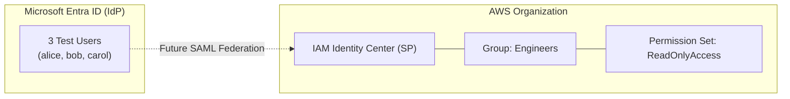

# Project 01: Multi-Cloud Identity Baseline

 *(Insert your Loom or YouTube unlisted link here)*

## Problem
**TICKET #IAM-001:** Security needs a sandboxed identity environment for two cloud platforms before any further IAM work begins. **Deliverable:** Documented Entra tenant + AWS Organizations setup with at least one identity in each, no shared admin credentials, and an architecture diagram of how they will eventually federate. Auditor will look at this in 30 days.

## Solution
Established a Microsoft Entra ID tenant to serve as the baseline Identity Provider (IdP) and an AWS Organization with IAM Identity Center as the Service Provider (SP). Configured standard test users with specific job titles in Entra and mapped foundational groups and permission sets in AWS. This environment serves as the foundation for future infrastructure-as-code (IaC) and SAML federation projects.

## Architecture Diagram

## Prerequisites
* Free Microsoft Account for Entra ID
* AWS Account (Root access)

## Setup Configuration
### Entra ID (IdP)
* **Primary Domain:** `[insert-your-domain].onmicrosoft.com`
* **Test Users Created:**
  * `alice@` (Platform Engineer)
  * `bob@` (SecOps Analyst)
  * `carol@` (Auditor)

### AWS (SP)
* **Region:** `[insert-your-region, e.g., us-east-1]`
* **AWS Organizations:** Enabled
* **IAM Identity Center:** Enabled
* **SSO Group:** `Engineers`
* **Permission Set:** `ReadOnlyAccess` (AWS Managed Policy)

## Verify Output
A reviewer reading this repository can verify the following:
* The target-state architecture is fully documented and utilizes an automated Diagrams-as-Code approach (Mermaid.js).
* The AWS region and Entra tenant domains are defined and established.
* The test accounts and access profiles are pre-staged for SAML and SCIM integration in upcoming projects.

## Estimated Cost
**$0/month** — All resources utilized in this baseline setup fall completely within the AWS Free Tier and Microsoft Entra ID Free tier. 

## Teardown
To destroy this environment and ensure no lingering resources:
1. **Entra ID:** Delete the three test users from the Users blade.
2. **AWS:** Navigate to IAM Identity Center, delete the `ReadOnlyAccess` permission set, delete the `Engineers` group, and disable IAM Identity Center from the settings page. 

---
*Built by Cameron Price*
