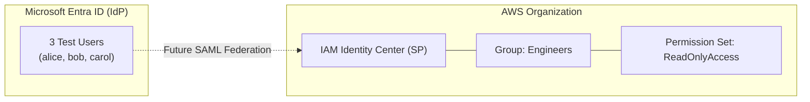

# ☁️ Project 01: Multi-Cloud Identity Baseline

> **🎫 TICKET #IAM-001: New Environment Provisioning**
>
> Security needs a sandboxed identity environment for two cloud platforms before any further IAM work begins.
> 
> **Deliverable:** Documented Entra tenant + AWS Organizations setup with at least one identity in each, no shared admin credentials, and an architecture diagram of how they will eventually federate. Auditor will look at this in 30 days.

---

## 🏗️ Architecture Target State

This repository establishes the standalone configurations for our Identity Provider (IdP) and Service Provider (SP). Utilizing **Diagrams-as-Code**, the target state for future SAML and SCIM integration is mapped below.

---

## ⚙️ Environment Configuration

### Microsoft Entra ID (Identity Provider)
| Component | Configuration |
| :--- | :--- |
| **Primary Domain** | `[insert-your-domain].onmicrosoft.com` |
| **alice@** | Platform Engineer |
| **bob@** | SecOps Analyst |
| **carol@** | Auditor |

### AWS (Service Provider)
| Component | Configuration |
| :--- | :--- |
| **Deployment Region** | `[insert-your-region, e.g., us-east-1]` |
| **AWS Organizations** | Enabled |
| **IAM Identity Center** | Enabled |
| **SSO Group** | `Engineers` |
| **Permission Set** | `ReadOnlyAccess` (AWS Managed Policy) |

---

## ✅ Verifiability

A reviewer assessing this repository can instantly confirm the following:
1. **Target-State Architecture:** Fully documented natively in markdown utilizing Mermaid.js.
2. **Environment Baselines:** AWS region and Entra tenant domains are strictly defined.
3. **Pre-staged Profiles:** Test accounts and access profiles are pre-staged for automated SAML and SCIM integration in upcoming projects.

---

## 💰 Cost & Teardown

* **Estimated Cost:** **$0/month** (All resources utilized fall completely within the AWS Free Tier and Microsoft Entra ID Free tier).

**To cleanly destroy this environment:**
1. **Entra ID:** Delete the three test users from the *Users* blade.
2. **AWS:** Navigate to IAM Identity Center, delete the `ReadOnlyAccess` permission set, delete the `Engineers` group, and disable IAM Identity Center from the core settings page.

---
*Built by Cameron Price*
